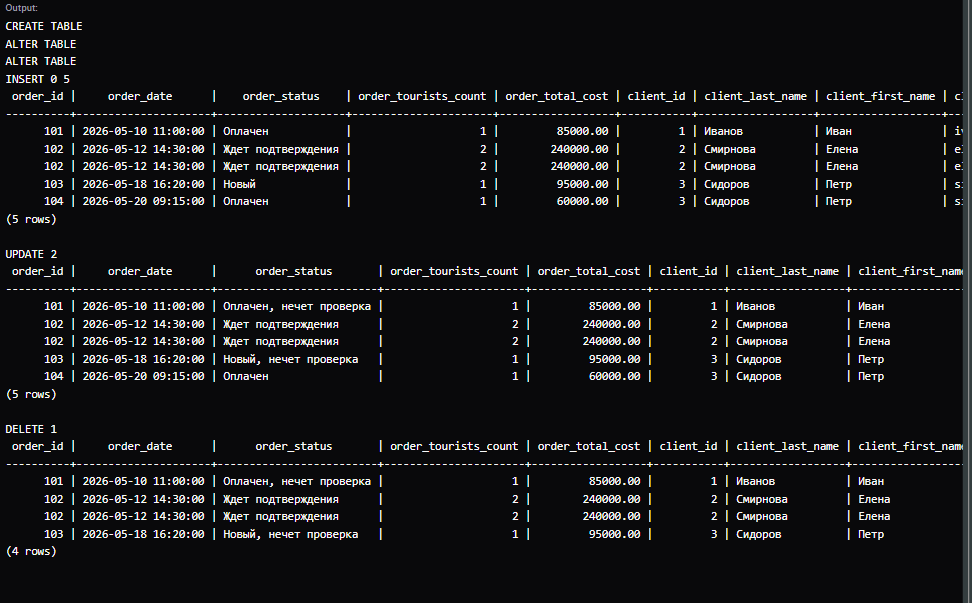
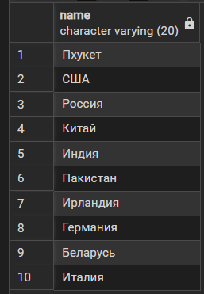
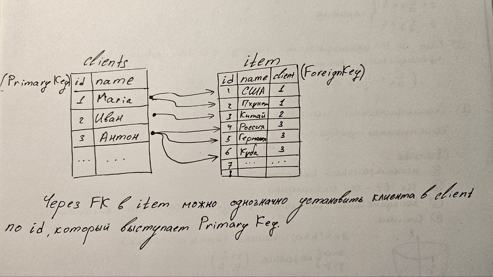
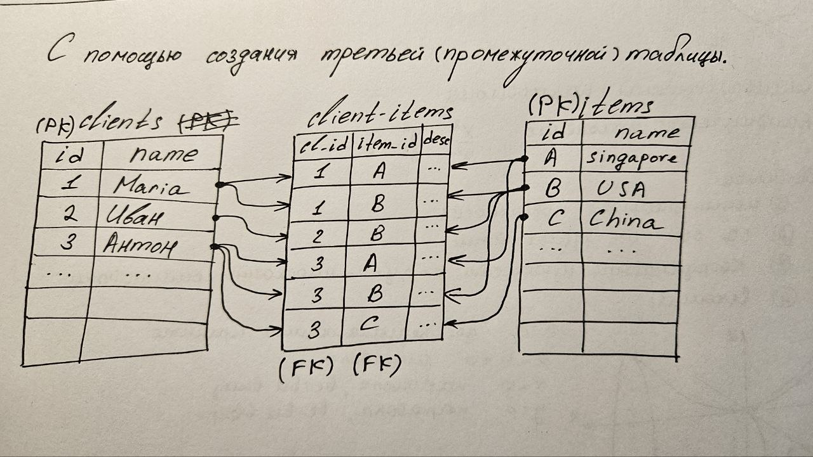

# Лабораторная работа №1
**Тематика:** Автоматизация работы туристического агентства

В данном репозитории представлена структура базы данных для управления процессами бронирования туров, регистрации клиентов, оформления договоров и проведения платежей.

---

## Описание бизнес-процессов

Функционал информационной системы охватывает полный жизненный цикл взаимодействия с клиентом:
1. **Регистрация клиента** — занесение личных и паспортных данных в систему.
2. **Выбор тура** — подбор актуального туристического направления по запросу.
3. **Приглашение других клиентов** — добавление дополнительных участников (туристов) к бронированию.
4. **Оформление договора** — создание заказа с фиксацией итоговой стоимости и ответственного менеджера.
5. **Оплата договора** — регистрация платежей (наличный/безналичный расчет).
6. **Закрытие сделки** — финальное изменение статуса заказа после выполнения всех обязательств.

---

## Описание информационных объектов (Схема БД)

### 1. Клиент (`clients`)
Содержит информацию о главном заказчике, на которого оформляется договор.

| Атрибут | Тип данных | Ограничения | Описание |
| :--- | :--- | :--- | :--- |
| `id` | INT | PRIMARY KEY | Уникальный идентификатор клиента |
| `last_name` | VARCHAR(50) | NOT NULL | Фамилия |
| `first_name` | VARCHAR(50) | NOT NULL | Имя |
| `username` | VARCHAR(50) | | Никнейм в системе / мессенджере |
| `phone` | VARCHAR(20) | NOT NULL, UNIQUE | Номер телефона |
| `email` | VARCHAR(100)| UNIQUE | Адрес электронной почты |
| `passport` | VARCHAR(20) | NOT NULL | Серия и номер внутреннего паспорта |
| `international_passport` | VARCHAR(20) | | Данные загранпаспорта |

### 2. Менеджер (`employees`)
Данные о сотрудниках агентства, ведущих сделки.

| Атрибут | Тип данных | Ограничения | Описание |
| :--- | :--- | :--- | :--- |
| `id` | SERIAL | PRIMARY KEY | Уникальный идентификатор сотрудника |
| `full_name` | VARCHAR(150)| NOT NULL | ФИО сотрудника |
| `position` | VARCHAR(50) | | Должность |
| `phone` | VARCHAR(20) | | Контактный телефон |

### 3. Тур (`tours`)
Справочник доступных для бронирования путевок.

| Атрибут | Тип данных | Ограничения | Описание |
| :--- | :--- | :--- | :--- |
| `id` | SERIAL | PRIMARY KEY | Уникальный идентификатор тура |
| `title` | VARCHAR(150)| NOT NULL | Название тура |
| `country` | VARCHAR(100)| NOT NULL | Страна назначения |
| `city` | VARCHAR(100)| NOT NULL | Город / Курорт |
| `hotel_name` | VARCHAR(100)| NOT NULL | Название отеля |
| `nutrition_type`| VARCHAR(10) | | Тип питания (например: RO, BB, HB, AI) |
| `start_date` | DATE | NOT NULL | Дата вылета / начала тура |
| `duration_nights`| INT | NOT NULL | Количество ночей |
| `price_person` | NUMERIC(10,2)| NOT NULL | Стоимость тура за одного человека |

### 4. Заказ (`orders`)
Документ, фиксирующий факт бронирования тура клиентом.

| Атрибут | Тип данных | Ограничения | Описание |
| :--- | :--- | :--- | :--- |
| `id` | SERIAL | PRIMARY KEY | Уникальный идентификатор заказа |
| `client_id` | INT | FOREIGN KEY → `clients.id` | Ссылка на клиента-заказчика |
| `employee_id` | INT | FOREIGN KEY → `employees.id`| Ссылка на оформлявшего менеджера |
| `tour_id` | INT | FOREIGN KEY → `tours.id` | Ссылка на забронированный тур |
| `order_date` | TIMESTAMP | DEFAULT CURRENT_TIMESTAMP | Дата и время оформления |
| `tourists_count`| INT | NOT NULL | Общее количество участников |
| `total_cost` | NUMERIC(10,2)| NOT NULL | Итоговая стоимость к оплате |
| `status` | VARCHAR(30) | | Текущий статус (Новый, Оплачен, Закрыт) |

### 5. Турист (`tourists`)
Информация о фактических участниках поездки.

| Атрибут | Тип данных | Ограничения | Описание |
| :--- | :--- | :--- | :--- |
| `id` | SERIAL | PRIMARY KEY | Уникальный идентификатор туриста |
| `last_name` | VARCHAR(50) | NOT NULL | Фамилия |
| `first_name` | VARCHAR(50) | NOT NULL | Имя |
| `username` | VARCHAR(20) | | Юзернейм |
| `birth_date` | DATE | NOT NULL | Дата рождения |
| `international_passport` | VARCHAR(50) | NOT NULL | Данные загранпаспорта |

### 6. Связь Заказа и Туристов (`order_tourists`)
Промежуточная таблица (многие-ко-многим) для привязки списка туристов к конкретному заказу.

| Атрибут | Тип данных | Ограничения | Описание |
| :--- | :--- | :--- | :--- |
| `order_id` | INT | FOREIGN KEY → `orders.id` | Идентификатор заказа |
| `tourists_id` | INT | FOREIGN KEY → `tourists.id`| Идентификатор туриста |

### 7. Платеж (`payments`)
История финансовых транзакций по заказам.

| Атрибут | Тип данных | Ограничения | Описание |
| :--- | :--- | :--- | :--- |
| `id` | SERIAL | PRIMARY KEY | Уникальный идентификатор платежа |
| `order_id` | INT | FOREIGN KEY → `orders.id` | Ссылка на оплачиваемый заказ |
| `payment_date` | TIMESTAMP | NOT NULL | Дата и время совершения операции |
| `amount` | NUMERIC(10,2)| NOT NULL | Сумма внесенных средств |
| `payment_method`| VARCHAR(20) | | Способ оплаты (Карта, Наличные, QR) |

---

## Результаты выполнения работы

### Часть 1. Основной результат выполнения скриптов
Ниже представлен скриншот успешного развертывания структуры базы данных и работы с данными:

### Часть 2. Выполнение пункта 8 (Использование оператора DISTINCT)
Скриншот выполнения запроса с фильтрацией уникальных значений:

### Часть 3. Выполнение пункта 9 (Объяснение работы Primary Key и Foreign Key)

### Часть 4. Выполнение пункта 10 (Объяснение реализации сетевой модели в объектно-реляционной базе данных)
